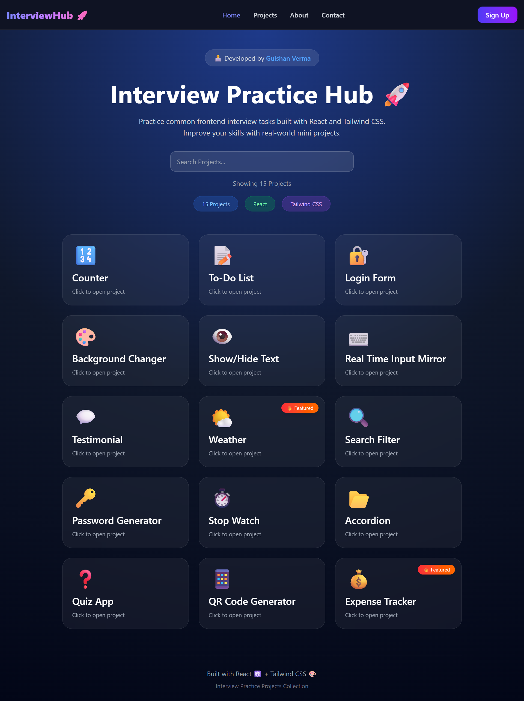

# 🚀 React Interview Practice Hub

A modern collection of **React.js mini projects** designed to practice common frontend interview questions and strengthen React development skills. Each project focuses on a specific concept frequently asked in technical interviews.

## 🌐 Live Demo

🔗 **Live Website:** https://react-interview-hub.vercel.app/

## 📂 GitHub Repository

🔗 **Repository:** https://github.com/gulshan44/interview-practice-hub

---

## ✨ Features

* 🚀 15+ React Interview Mini Projects
* 🔍 Real-time Project Search
* 📱 Fully Responsive Design
* 🌙 Modern Dark Theme UI
* ⚡ Fast Performance with Vite
* 🎨 Styled with Tailwind CSS
* 🧩 Reusable React Components
* 📂 React Router Navigation
* 💻 Beginner to Intermediate React Concepts
* 🎯 Interview-Oriented Practice

---

## 📂 Projects Included

- 🔢 Counter
- 📝 To-Do List
- 🔐 Login Form
- 🎨 Background Changer
- 👁️ Show / Hide Text
- ⌨️ Real Time Input Mirror
- 💬 Testimonial Slider
- 🌤️ Weather App
- 🔍 Search Filter
- 🔑 Password Generator
- ⏱️ Stopwatch
- 📂 Accordion
- ❓ Quiz App
- 📱 QR Code Generator
- 💰 Expense Tracker

---

## 🛠️ Tech Stack

* React.js
* Vite
* Tailwind CSS
* React Router DOM
* React Icons
* JavaScript (ES6+)

---

## 📥 Installation

Clone the repository

bash
git clone https://github.com/gulshan44/interview-practice-hub.git

Go to the project directory

bash
cd interview-practice-hub

Install dependencies

bash
npm install

Start the development server

bash
npm run dev

Build for production

bash
npm run build

---

## 🎯 Learning Objectives

This project helps you practice:

* React Fundamentals
* useState Hook
* Conditional Rendering
* List Rendering
* Form Handling
* API Integration
* React Router
* Component Reusability
* Responsive Design
* Tailwind CSS
* Clean Code Practices

---

## 👨‍💻 Author

**Gulshan Verma**

* GitHub: https://github.com/gulshan44
* Portfolio: https://react-interview-hub.vercel.app/

---

## ⭐ Support

If you found this project helpful, consider giving it a ⭐ on GitHub.

Happy Coding! 🚀
